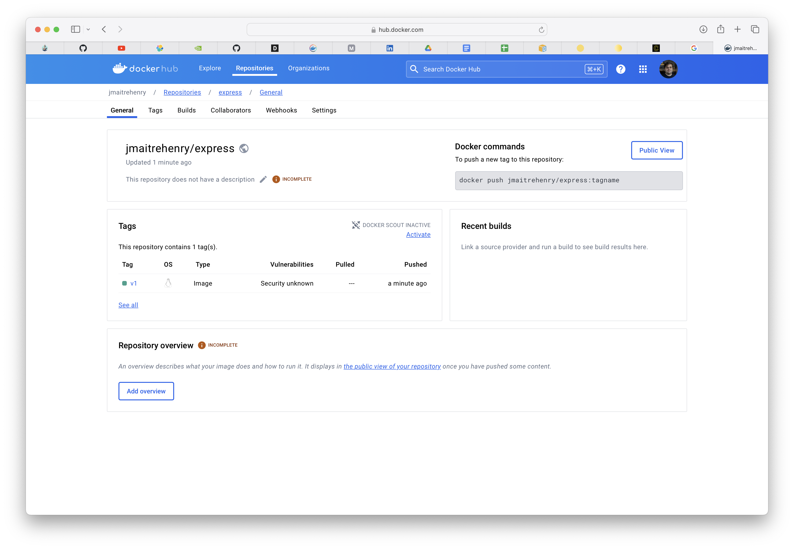
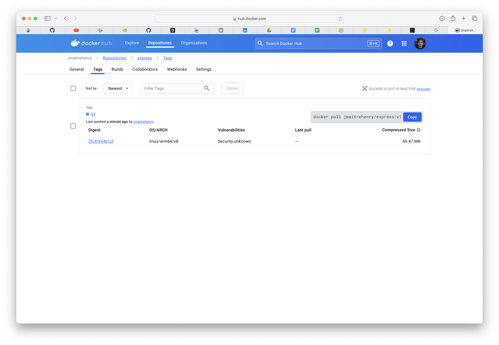
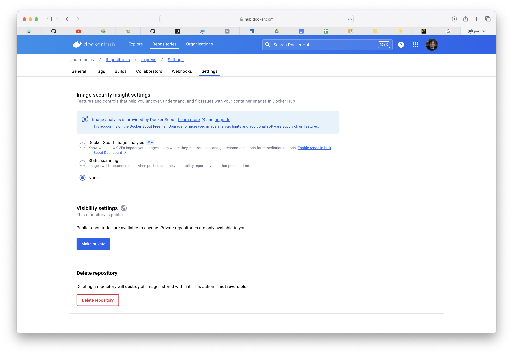

# L09 - Pousser vers Docker Hub

## Docker Hub

Rendez-vous sur https://hub.docker.com et assurez-vous de pouvoir vous connecter.

## Ajouter un fichier Dockerfile

À l'aide de la commande `docker init`, générez un fichier `Dockerfile`.
Le port utilisé par l'application est le port 3000.

## Ajoutez un Tag en utilisant le nom de votre compte Docker

Pour les commandes suivantes, remplacez `<YourRegistryName>` par votre nom de registre.

## Construire l'image

    docker build -t <YourRegistryName>/express:v1 .

## Poussez l'image

    docker push <YourRegistryName>/express:v1

## Docker Hub

De retour sur hub.docker.com, localisez l'image que vous venez de pousser:

## Extraire l'image de Docker Hub

Commençons par supprimer l'image locale et retirons-la de Docker Hub.

## Supprimer l'image

    docker rmi <YourRegistryName>/express:v1

## Tirez l'image

    docker pull <YourRegistryName>/express:v1

---

## Créer la version 2

À l'aide des commandes que vous avez apprises précédemment, créez et transférez cette nouvelle version vers Docker Hub.

## Construire l'image v2

    docker build -t <YourRegistryName>/express:v2 .

## Poussez l'image

    docker push <YourRegistryName>/express:v2

## Docker Hub

De retour sur hub.docker.com, localisez l'image que vous venez de pousser:

## Supprimer l'image locale

    docker rmi <YourRegistryName>/express:v2

## Tirez l'image

    docker pull <YourRegistryName>/express:v1

## Nettoyer

    docker rmi <YourRegistryName>/express:v1
    docker rmi <YourRegistryName>/express:v2

Pour supprimer l'image sur le Hub, allez dans l'onglet **Settings**, puis **Delete Repository**:

