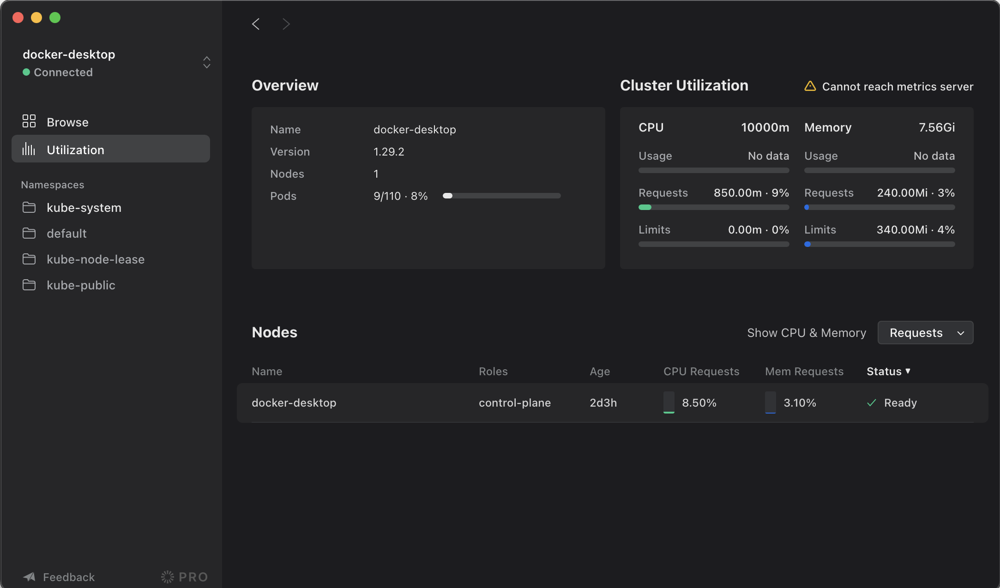

# L33 - Infra App

InfraApp est un client kubernetes graphique que vous pouvez installer sur Windows, Mac et Linux.

    https://infra.app/

## Installer Infra App

Directement depuis le site Web.

## Lancer Infra

Vous devez être connecté à votre cluster sur (1) Docker Desktop. 

Les clusters déjà présents dans le fichier de configuration seront répertoriés dans le menu déroulant.

Une fois installé, vous devriez voir quelque chose comme ceci :

## Déployer l'application

    kubectl create -f hello-deployment.yaml

## Dashboard

Choississez le namespace **default**, clickez sur le déploiement et examinez les pods.

## Modifier un déploiement à l'aide de l'interface

Allez sur l'onglet **YAML**, clickez sur **Edit** et modifier le nombre de réplicas. Appliquez le changement.

## Supprimer un pod à l'aide de l'interface

Sur la vue d'un déploiement, sélectionnez l'un des pods et supprimez-le en cliquant sur l'icone **...** puis **Delete**. Vous remarquerez que le pod sera remplacé presque immédiatement.

## Nettoyer

    kubectl delete -f hello-deployment.yaml
